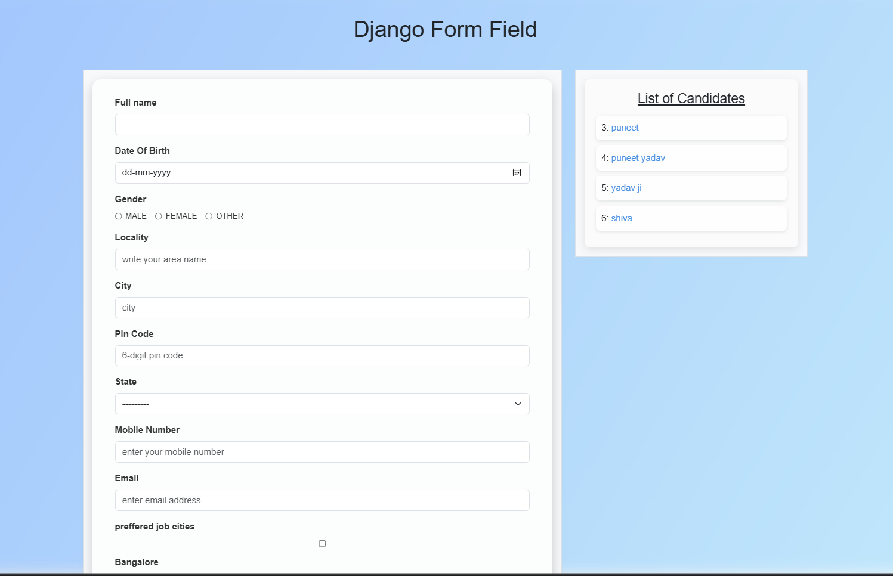
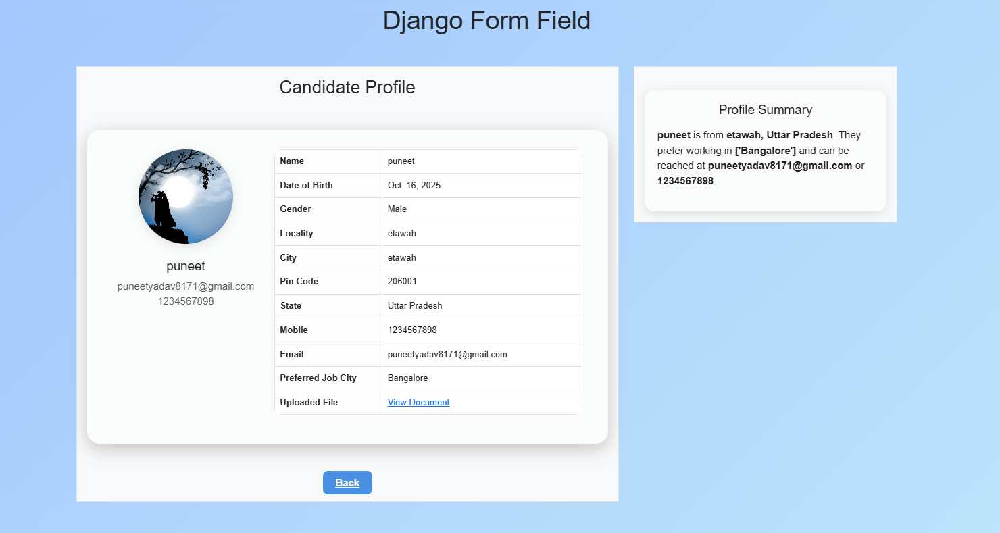

# Candidate Profile Management

A **Django web application** to manage candidate profiles with a modern glassy UI. Users can **add candidates, view their profiles, and upload documents/images**.  

## Features

- Add and store candidate details (Name, DOB, Gender, Contact, Address, Job Preferences).  
- Upload profile images and documents.    
- Responsive layout with right-side summary panel.  

## Technologies Used

- Django 5.x  
- Python 3.x  
- HTML, CSS  
- Bootstrap 5  

## Screenshots

- **Home / Candidate Form** – Glassy blurred layout with form.
 
- **Candidate Profile** – Profile card with image, table details, and summary panel.
   

